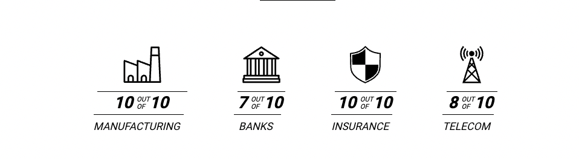
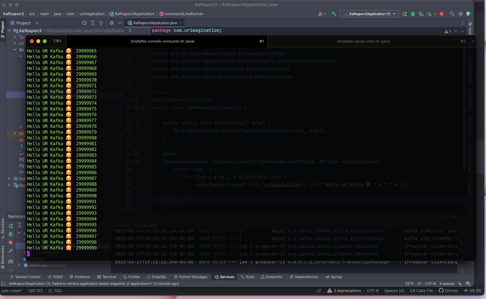
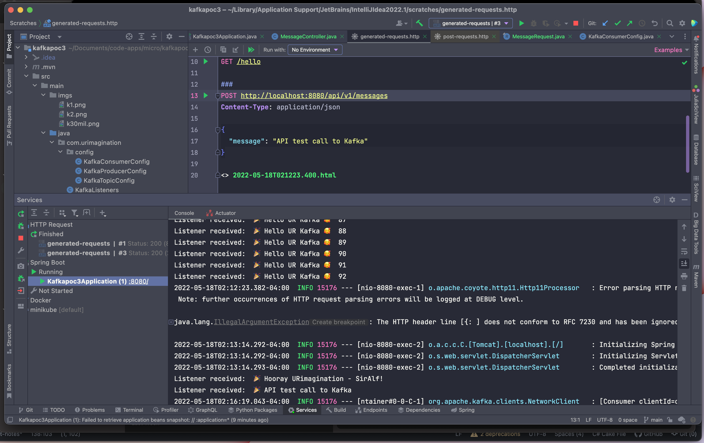

APACHE KAFKA QUICK POC
...

APACHE KAFKA
More than 80% of all Fortune 100 companies trust, and use Kafka.

Apache Kafka is an open-source distributed event streaming platform used by thousands of companies for high-performance data pipelines, streaming analytics, data integration, and mission-critical applications.
...

more content coming soon!
On this quick POC we write produce 30 million messages under
3 minutes

QUICK REST API TO CONSUME APACHE KAFKA MESSAGES

